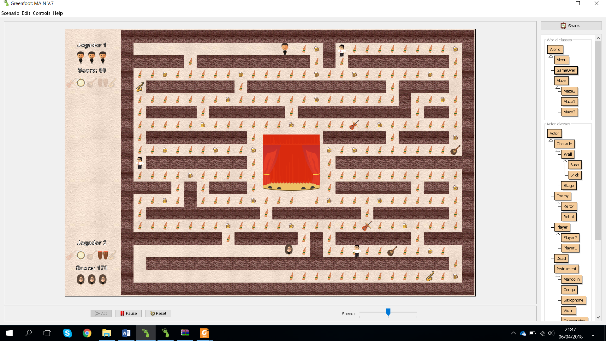
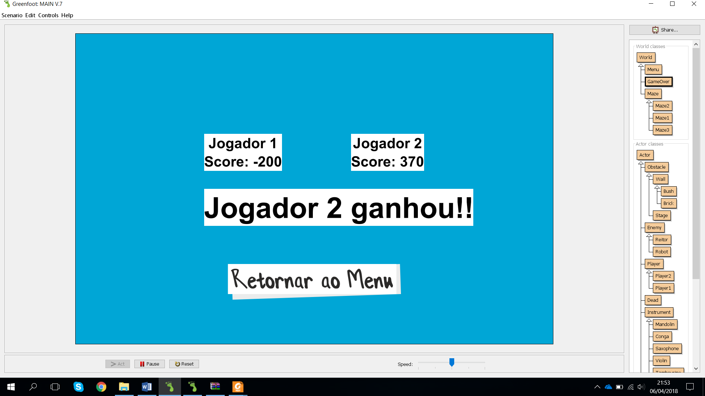
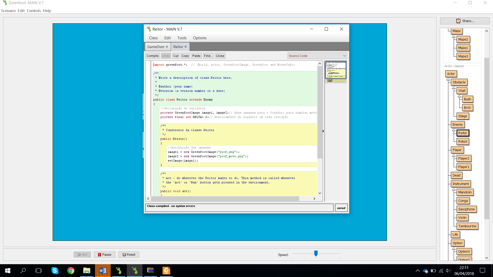
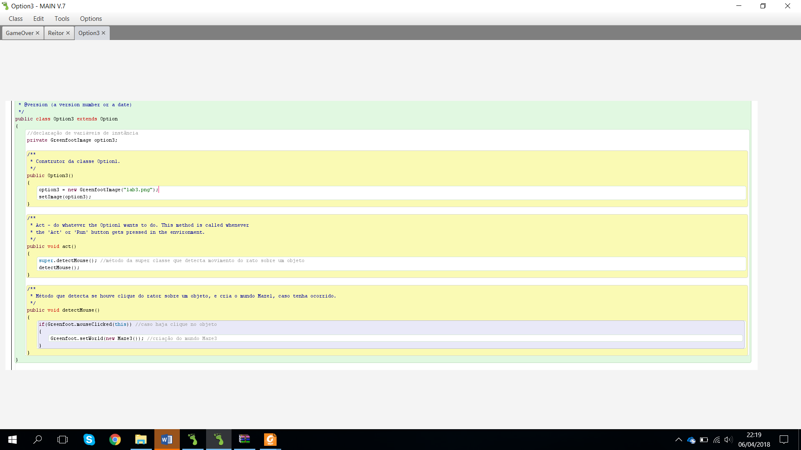
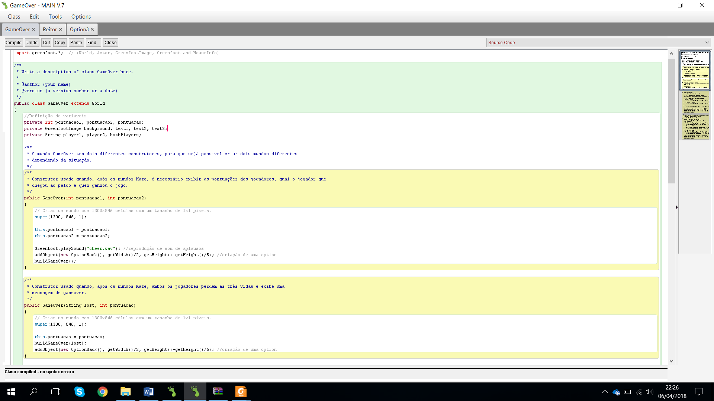

# GreenFoot TUNA project

## Introduction

This project was carried out within the scope of the Object Oriented Programming unit, where the aim is to develop a game using a Greenfoot platform, based on the theme of “traditional academic tunas in higher education” (for more information about it https://en.wikipedia.org/wiki/Tuna_(music)).
Its main objective is the development and application of the knowledge acquired in class, making an introduction to programming in JAVA, in a more interactive and simplified way for learning with the Greenfoot software.
 Two types of requirements were requested, game and object-oriented programming. In relation to the game requirements are: having two players playing simultaneously, individual scores that are edited in real time, changes in the appearance of the world during the course of the game, indication of the winner, with a due score obtained at the end of the game. There is no need to respect the requirements of object-oriented programming: definition and use of methods and variables, initialization of objects using the constructors, result of methods with a minimum of two levels in addition to Actor, Overrinding and Overloading of methods, and encapsulation.
It is important to note that Overrinding refers to the redefinition of a method in a subclass, Overloading refers to the definition of a method with the same name, but with a list of different parameters. Encapsulation in turn is considered a golden rule of object-oriented programming that objects are independent independent, that is, instance variables are always private, which means that direct access to variables only occurs in the class that it is inserted, through its methods, thus obtaining a greater integrity of the data.
Throughout this concept you will have a brief introduction to the game and its concept, and an explanation of the implementation of each class along with the different interactions between them.

## Concept

After brainstorming about the concept and how to implement the game, from the figures to some methods to be implemented. It was decided on the idea that two members of TUNA would be late for the concert, at the Queima / Enterro enclosure, in which each member had to pick up all the instruments and go to the stage, but on their way, they tried to “drink” as many beers and mugs as quickly and effectively as possible.
The game developed is based on the Arcade game style where a maze was created with several objects scattered and enemies by it.
It starts with a selection menu where players, with the mouse, select from among three mazes which they want to play. When the maze is selected, the game with the two players, three Rector enemies, with ten instruments, two of each category, with mugs and beers, which are the bonus points, and the arrival stage where the game ends, is started. Each player starts with three lives, with a score of zero and with the list of instruments to be filled out, this information is present on the left side of the maze.
The objective of the game is to collect the instruments scattered around the playing field, trying to collect as many beers and mugs as possible in the process, but avoiding the Dean, who whenever he touches a player takes away a "life" and points. After one of the players has acquired all the instruments, the stage will open, and that player will be able to go there and finish the game. However, when the stage opens, four Robots appear who are also enemies, making the player have to maneuver to reach the stage.
To win one of the players will have to reach the board, and the player with the most points wins when the game is over, regardless of whether he has picked up all the objects or not. If both players lose all their lives without reaching the stage, there is no winner and they will have to try again.

## Implementation

Moving on to the explanation of how the game was implemented, we started by defining classes and subclasses in order to have the minimum of repeated and unnecessary code. With that idea in mind it was created as subclasses World **Menu**, **GameOver** and **Maze**, and as subclasses Actor **Obstacle**, **Enemy**, **Player**, **Instrument**, **Life**, **Dead**, **Option** and **BonusPoint**.

### World Implementation

The first challenge, right from the start, when implementing World, was to find a practical and functional way to build the mazes. After some research, we chose to use character mapping to objects using a String the length of our World. This method was chosen because it allows greater flexibility to modify it and add more objects, taking into account the number of objects that are inserted in each labyrinth. With this method, it also allowed for a more simplified and easier to understand code.

#### Menu class

The **Menu** class is a class that contains the game's introduction image, where it allows the user to select the maze he wants to play. For the selection of the mazes, a method was implemented that allows the use of the mouse in order to make it more iterative.

#### Maze class

The **Maze** class contains the subclasses Maze1, Maze2, and Maze3. This class is the main one in the game and the subclasses, Maze1, Maze2 and Maze3, only contain the String of the different maze maps.
Within this are defined the method of construction of the maze, the construction of the sidebar, the summers of the scores, the count of lives of the players.
The method of building the labyrinth is the method, mentioned above, that
receives the String from the labyrinth chosen by the user and creates it by placing the objects in the correct position according to the character defined for the element, for example, the character "W" corresponds to an object of the Bush class.
However, the method of building the sidebar is a method that adds, on the left side, the information about the scores, lives and instruments collected, being updated in real time, thus allowing the user to know, at any time, their current score, current number of lives and what instruments he has collected and what are missing.
It is also the class that controls the introduction of objects of the Robot subclass when the stage opens.

#### GameOver class

The **GameOver** class is displayed when the game is over, where it shows the scores with a victory or defeat message depending on the situation and also features a checkbox allowing users to return to the Menu class and play again.
Regarding messages and scores, in the situation of both players are alive and one player ends, shows the players' scores and writes a message saying which player has won. If one of the players has been eliminated, it shows the message of the winning player with his score and another with a message saying that player was eliminated. And, if both players are eliminated, no score is shown, but a message saying "Try again".

### Actor Implementation

After the idea of building the labyrinths on the march, it started with the creation of the Actors for the project, as the theme is TUNA, it was decided to make two costumes as players and as opponents, Rector, who symbolizes a teacher, and the Robot, which symbolizes the security of the enclosure.
Bearing in mind the theme, it was decided to use beers and beer mugs as consumables, with beer (bottle) giving the player 5 points and the pen 10 points and musical instruments that give a score of 20 to unlock the stage. points for each of them, which require the player to be beaten at five in order to unlock the stage.
These actors and objects were created with the help of image creation and editing software.
In Actor the following classes were implemented:

#### Obstacle class

The **Obstacle** class is the class of objects that cannot be “pierced” by the objects of the class **Enemy** and **Player**, thus allowing the creation of walls to outline the mazes. Within this class, there is the subclass Stage, which corresponds to the stage, and the subclass Wall, which contains the objects that make up the walls of the labyrinth, where the Bush and Brick objects are.

#### Enemy class

The **Enemy** class has subclasses Rector and Robot. The objects in this class move alone and randomly along the maze, allowing for the unpredictability factor for those who are playing. They even move slightly faster than the players, to penalize the player more for wrong movements, and if they intercept any of the players remove a life and 100 points. Robot class objects only come into play when the stage opens, they also have a random movement, a greater speed of movement than the player, so that it is more complicated for the player to reach the goal, the stage.

#### Player class

The **Player** class is made up of the subclasses Player1 and Player2 and this is the class that allows the user to interact with the game.
This class is one of the most important in the job, as it is the class that brings the game to life. Each **Player** moves according to the key pressed on the keyboard, in the case of Player1 the keys w, a, s, d are used and for Player2 the arrow keys are used.
In each subclass of **Player** functions are defined for the removal of objects of either the **Instruments** or **BonusPoint** class, when touching them, with the increment of the score and also the function that deals with the subtraction of points when any of the objects of the **Enemy** class touches on one of the players. The sounds of when a player “drinks” a mug, opening the stage and having lost a life are also implemented.
The biggest barrier that was found with the implementation, both of the **Enemy** class and the **Player** class, was the intercession with the walls (Walls) and the stage (Stage) of the labyrinth. For that, it was necessary to create a method that was always checking if there was an object of the **Obstacle** class at x distance from its image center and, if it confirmed, calls another method that prevents the object from moving in that direction.

#### Dead class

The **Dead** class contains the object that is assigned when a player loses a life, and also appears on top of the player when he loses all three lives.

#### Instrument class

The **Instrument** class, is the class with the most subclasses. These are Mandolin, Conga, Saxophone, Violin and Tambourine. These objects are scattered throughout the maze and have no action implemented on them.

#### Life class

The **Life** class was created with the objective of defining the 3 lives of the players with smaller images of themselves. No longer containing any type of instruction.

#### Option class

To create a **Mazes** selection menu, the **Option** class was created, which contains the subclasses option1, option2, option3 and optionback, which serve as access to the respective mazes. Access is done by clicking on a mouse on one of these objects.

#### BonusPoint class

The **BonusPoint** class contains the subclasses Beer and BeerBoutle that constitute the consumables that appear in the mazes, which give points to the players.

## Requirements

Exemplification of the in-game implementation of the requested requirements mentioned in the introduction.

* Two players competing simultaneously:
All mazes are designed for two players, using the WASD keys to move Player1 and the arrows for Player2.
* Individual scores for both players with the score updated in real time:
During the game in the Maze world the score is updated in real time as shown.

* Changing the appearance of the world (for example, background, object position, or colors) during the game:
There is a change in the appearance of the world several times, for example when going from the menu to the game and then to the results screen.
* Indication of the winner and the score obtained at the end of the game:
>
In the figure below it is possible to visualize one of the possible ways to build the world GameOver, in which one of the players reaches the stage without the other player losing the 3 lives.

* Definition and use of methods and variables:
As demonstrated throughout the previous explanation of the implementation, several methods and variables have been defined.
* Object initialization using the constructors:
>
Continuing the methodology/practice referred to in classes, the figure below is an example.

Inheritance of methods with a minimum of 2 levels in addition to Actor:

! [image](./ReadMeImages/ExampleActoranClassesAndSubclasses.png)

* Overriding methods:
>
Overriding of the detectMouse() method in one of the subclasses of the Option class.

* Method overloading:
>
For example overloading the world GameOver constructor.

* Encapsulation:
>
All project instance variables are defined as private.

## Conclusion

Based on the entire project implementation process, it appears that all requirements have been achieved and in this way the objectives initially set have been achieved. During the realization of the project, more experience was gained and more at ease with the Greenfoot software and the Java language, we also had the opportunity to put into practice the knowledge acquired in the theoretical and laboratory classes.
Most of the initial ideas were achieved, from operation to appearance. A possible improvement would be the inclusion of a counter, clock, to introduce another limiting element for the game, more **Enemys**, **Players**, **Instruments** and **Mazes** for greater variability, giving the user more choice and levels. A table with the best results, and how to select a player customized by the user would also be interesting ideas to explore.
In short, this first project was a more interactive approach to coding in JAVA, allowing us to have a visual response, almost immediately, to the code produced, which is an added value in terms of knowledge acquired to apply in the next project.

## Bibliography

* Flaticon. [Online] [Citação: 16 de março de 2018.] https://www.flaticon.com/free-icon/mandolin_129619.
* Flaticon. [Online] [Citação: 16 de março de 2018.] https://www.flaticon.com/free-icon/french-horn_129610.
* Flaticon. [Online] [Citação: 16 de março de 2018.] https://www.flaticon.com/free-icon/conga_129599.
* Flaticon. [Online] [Citação: 16 de março de 2018.] https://www.flaticon.com/free-icon/lyre_129618.
* Flaticon. [Online] [Citação: 16 de março de 2018.] https://www.flaticon.com/free-icon/violin_140232#term=musical instrument&page=2&position=46.
* Flaticon. [Online] [Citação: 16 de março de 2018.] https://www.flaticon.com/free-icon/tambourine_140212#term=musical instrument&page=3&position=15.
* Flaticon. [Online] [Citação: 16 de março de 2018.] https://www.flaticon.com/free-icon/saxophone_625416#term=musical instrument&page=7&position=28.
* Beers free icon. Flaticon. [Online] [Citação: 16 de março de 2018.] https://www.flaticon.com/free-icon/beers_659381#term=beer&page=2&position=84.
* Cameirão, Mónica. 2018. Programação Orientada po Objetos. Moodle Faculdade de Ciências Exactas e da Engenharia. [Online] fevereiro de 2018. [Citação: 26 de fevereiro de 2018.] http://moodle.cee.uma.pt/pluginfile.php/47750/mod_resource/content/1/03.%20Greenfoot%20-%20Utiliza%C3%A7%C3%A3o%20de%20m%C3%A9todos%20II.pdf.
* —. 2018. Programação Orientada por Objetos. Moodle Faculdade de Ciências Exatas e de Engenharia. [Online] 26 de fevereiro de 2018. [Citação: 6 de março de 2018.] http://moodle.cee.uma.pt/pluginfile.php/47861/mod_resource/content/1/Enunciado%20do%20Projeto%201.pdf.
* —. 2018. Programação Orientada por Objetos. Moodle Faculdade de Ciências Exactas e de Engenharia. [Online] fevereiro de 2018. [Citação: 23 de fevereiro de 2018.] http://moodle.cee.uma.pt/pluginfile.php/47674/mod_resource/content/1/02.%20Greenfoot%20-%20Utiliza%C3%A7%C3%A3o%20de%20m%C3%A9todos%20I.pdf.
* —. 2018. Programação Orientada por Objetos. Moodle Faculdade de Ciências Exactas e da Engenharia. [Online] fevereiro de 2018. [Citação: 26 de fevereiro de 2018.] http://moodle.cee.uma.pt/pluginfile.php/47755/mod_resource/content/1/Solu%C3%A7%C3%B5es%20Ficha%201.pdf.
* —. 2018. Programação Orientada por Objetos. Moodle Faculdade de Ciências Exatas e da Engenharia. [Online] março de 2018. [Citação: 2 de março de 2018.] http://moodle.cee.uma.pt/pluginfile.php/47860/mod_resource/content/1/04.%20Greenfoot%20-%20anima%C3%A7%C3%B5es%2C%20imagens%20e%20cores.pdf.
* —. 2018. Programação Orientada por Objetos. Moodle FCEE. [Online] março de 2018. [Citação: 2 de março de 2018.] http://moodle.cee.uma.pt/pluginfile.php/47876/mod_resource/content/1/05.%20Greenfoot%20-%20scores.pdf.
* —. 2018. Programação Orientada por Objetos. Moodle FCEE. [Online] março de 2018. [Citação: 9 de março de 2018.] http://moodle.cee.uma.pt/pluginfile.php/47879/mod_resource/content/1/Solu%C3%A7%C3%B5es%20Ficha%202.pdf.